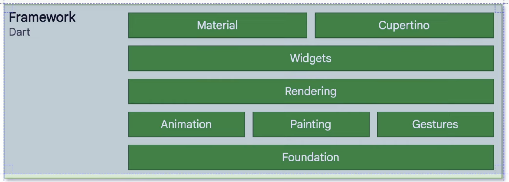
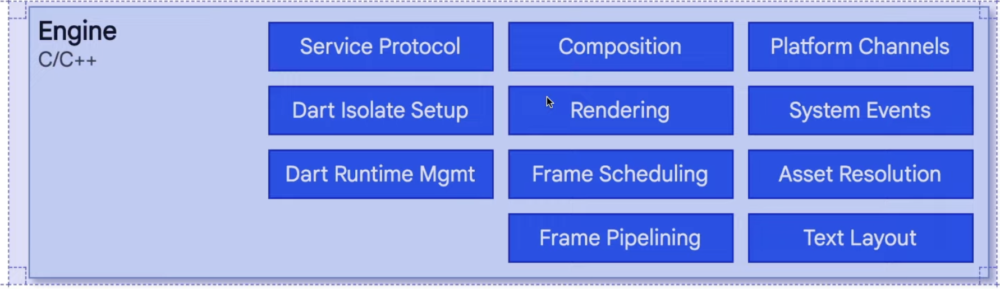

# About Flutter

## 프레임워크

틀 안에서 짜여진 동작을 하는 시스템

### Material and Cupertino

머티리얼 은 안드로이드 뿐만 아니라 모든 플랫폼에서 사용 가능  
일반적인 iOS 앱처럼 보이게 하고 싶으면 쿠퍼티노를 사용해야 함  
다만 라이센스 문제 때문에 쿠퍼티노는 iOS 기기에서 사용해야 함

그렇다고 이게 네이티브 컴포넌트인건가? 아니다. 그저 그럴싸하게 그려줄 뿐

## 엔진

얘가 중간에서 그려주고 플랫폼 별 OS랑 통신하면서 기능 수행을 하게 해 준다.

> React Native는 중간에 엔진을 거치지 않고 바로 네이티브 컴포넌트를 그린다는데 있다.

플랫폼에 종속되지 않은 자유로운 컴포넌트 디자인에 강점이 있다.
